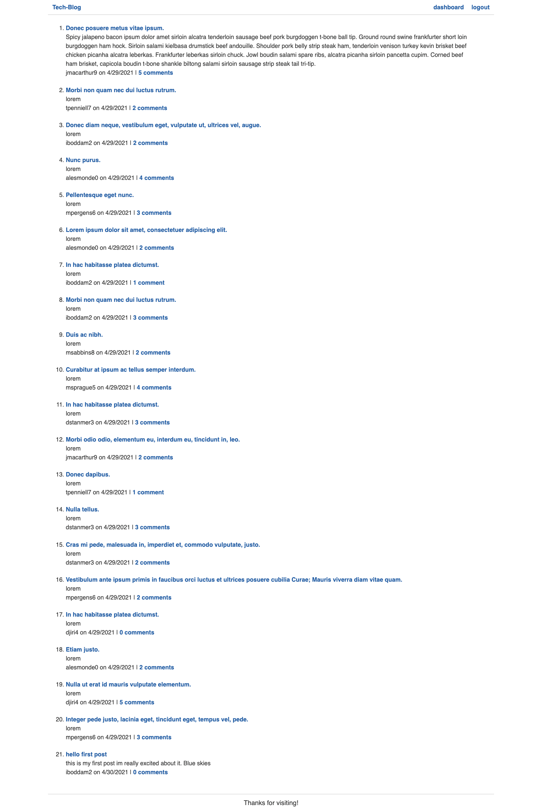

# Tech-Blog
   

  
  ## Table of Contents
* [License](#license)
* [Questions](#questions)
## Description
A cms style blog that utilizes the handlebars templating engine to generate html.  Users can make an account, log in, view blog posts from other users, upload their own posts, edit their posts, comment on posts, and view all their own posts.
## Deployed application
https://git.heroku.com/intense-scrubland-42944.git
## License
MIT License
## Questions
For any questions reach out on [GitHub](https://github.com/PaulKup) or by email: kupiszewskist1@gmail.com
